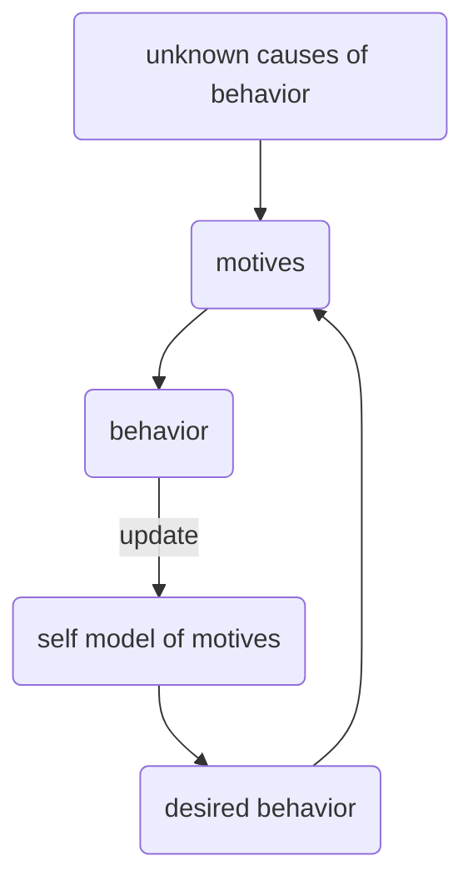

# π arc

##### Metadata
created:: 2022-08-29 09:23
modified:: <%+ tp.file.last_modified_date() %>
mode:: #mode/creation
kind:: #project/startup 
status:: #status/raw
parent:: [[π Quantified Self]], [[∂ Startup Dashboard]]
***
## Project Summary
Other possible names:
- something to do with illumination or a flashlight (referencing the idea that this app helps you understand your "shadow" self)
- MyGraph (MyGraphs)
- Motif
- Motive
- arcmod (I really like this one -- it has the connotation of modifying your arc -- and it is unique enough that the domain names will be available and inexpensive)

Arc is a behavior change app. It's name comes from the notion of [[intentional arc]], developed by Maurice Merleau-Ponty and elaborated by [Huber Dreyfus](https://knowledge-ecology.com/2017/05/21/dreyfus-and-the-intentional-arc/). The intentional arc is the feedback loop in which our actions and perceptions are drawn out of us by the world via affordances, after which they fold back and alter the world and what it affords. 

Consider the following loop:



Let's define a _motive_ as anything that drives our behavior, whether it be external or internal, conscious or unconscious. Let's also assume that humans have an internal model of the motives that drive our behavior, and that it is constantly updating itself whenever we learn that we were wrong about our motive(s) for a given behavior.

Because of the fact that there will always be motives that we do not have access to, there will always be a gap between what we assume drives our behavior and what actually drives our behavior. The size of this gap varies from person to person, but everyone has it. Let's call it the *Motive Model Gap*. The notion of a *motive* captures most of the forces that drive behavior (e.g., goals, habits, sociocultural pressures, biological needs, etc.). We *model* our motives in order to have an answer for questions about why we behaved in the way we did. And the same need that compels us to have such answers ready--i.e., our need to have a stable and predictable identity over time--also introduces forces that nudge our models to be inaccurate in specific ways that make it easier for us to maintain that stable sense of identity. The Motive Model Gap is a concept that points to just how inaccurate our models are.

My thesis is that most efforts to change our behavior fail not because we haven't found the right app or the right system. Rather, our efforts to change fail because we lack insight into our Motive Model Gap. We fail because we are blind to the core values, drives, habits, and systems that consistently stop us from changing. And we are blind to these things because we have compelling incentives to be blind to them.

For example, when I fail at work, it is often because I am trying to operate as if my memory and my innate interest/curiosity/sense of responsibility will be sufficient to ensure I get things done. But this has been proven wrong so many times. When I fail, it is primarily a failure to have and adhere to a system. In order to make room for my true strengths (curiosity, attention to detail, creativity), I need to trust a system rather than myself, and I haven't built this skill yet. This app would focus all of my attention on building that skill/habit until it is in place. 

Most efficiency systems target the process of effective planning and time/resource management. In other words, these systems are prostheses designed to help users create some future state. Insights into the past and current states are byproducts at best. Few (if any) of them have successfully leveraged tools that are specifically designed to help users narrow the Motive Model Gap. Another way of framing the same point: all skills are developed to satisfy a need. The current ecosystem of scheduling/efficiency/management apps focus on the skill building without explicitly acknowledging the need. 


## Rollups
### Subprojects
```dataview
Table
FROM #project 
WHERE contains(parent, link(this.file.name))
```

### Task backlog
```dataviewjs

let curr = dv.current();
let curr_nm = curr.file.name;

let proj_pages = dv.pages('#project')
	.where(p => 
		dv.array(p.parent).includes(dv.current().file.link) ||
		p.file.name == curr_nm
	)
	.file.link

let all_tasks = dv.pages().file.tasks
	.where(t => t.project)
	.where(t => proj_pages.includes(t.project)
	)

let done_tasks = all_tasks.where(t => t.completed)
let still_tasks = all_tasks.where(t => !t.completed)
	
dv.header(4, 'Remaining tasks:')	
if (still_tasks.length > 0){
    for (let group of still_tasks
		    .groupBy(t => t.project)
		){
			dv.header(5, group.key)
			dv.taskList(group.rows, false)
		}
} else {
	dv.el("em", "No pending tasks")
}

dv.paragraph('<br><hr>')
dv.header(4, 'Completed tasks:')	
if (done_tasks.length > 0){
    for (let group of done_tasks
		    .groupBy(t => t.project)
		){
			dv.header(5, group.key)
			dv.taskList(group.rows, false)
		}
} else {
	dv.el("em","No completed tasks")
}
```

### Contextual Notes
```dataviewjs
let curr = dv.current()

let pages = dv.pages("#periodic/daily and -#project")
	.where(p => {
		if (p.sendto) {
			let sendto = dv.isArray(p.sendto) ? 
				p.sendto : 
				dv.array(p.sendto);
			if (sendto.some(str => str.includes(curr.file.name))) {
				return true
			}
		}		
	})
	.sort(p => p.file.cday, "asc")

function formatLinks(page) {
	let st_arr = dv.isArray(page.sendto) ?
		page.sendto.filter(str => str.includes(curr.file.name)) :
		dv.array(page.sendto).filter(str => str.includes(curr.file.name));

	let link_arr = st_arr.map(str => {
		return dv.sectionLink(
			page.file.name,
			("sendto:: " + str.replace(/\[\[/g, '').replace(/\]\]/g, '')),
			false,
			str.replace(/\[\[.*?\]\]/g, '')
		)
	});

	return link_arr
}

// set up table
dv.table(
	["File", "Note"], 
	pages
	.map(b => [
		b.file.link,
		formatLinks(b)
	])
)
```


***
## Notetaking
- Markdown-based 
- Like Obsidian, it is built with JS, and there is an SDK that allows users to build their own plug-ins and add-ons.
- You can assign a URI to any arbitrary bit of information. Just highlight and select "reify". This sends the information to the database, allows you to assign attributes and send the info to another note, etc.
- You can link to any note from any other note
- On any note, you can send "contextual notes" to another note. These will appear at the bottom in a list or table (user decides)
- On any note, you can send tasks to another note. These will also appear at the bottom in a list or table. 
* Arbitrary aggregation of incoming "data" into a note. For example, in a given note, you can specify that you want to see all of the contextual notes and/or tasks for a subset of other notes
* contextual notes and tasks will point to the same data asset across all versions. In other words, if I modify a task in one note, it will modify it in every note that contains it. 

## Planning UI
Most apps enforce some schema or hierarchy. This app allows you to create your own entity hierarchy. Maybe you really care about aligning projects with goals, and goals with core values. Maybe you don't buy into the notion of goals and prefer to think about systems instead. The Planning UI is designed to be flexible enough for you to use any approach that makes sense to you.

* Each row is an action item. 
* The action items exist in a collapsible hierarchy; each item can have an arbitrary number of parents and/or children.
* If an action item has children, many of its features will automatically become aggregations of its children rather than user-supplied. 
* Each action item has an arbitrary set of metadata fields, controlled by the user, but comes with the following default columns (which can be toggled off):
	* **Item name** 
	* **Entity type**: is this item a goal? A system? A project? An ad-hoc request? etc.
	* **Estimated time left** to complete task
	* **Due datetime**
	* **Importance score**: This is a user-supplied field that indicates how much the parent item would suffer if this item didn't happen. 
	* **Priority score** (calculated): a metric reflecting how urgent an item currently is. It is a function of
		1. current datetime
		2. due datetime
		3. estimated time left
		4. combination of the importance scores of the item and all of its parents
	* **Deliverable:** make the outcome of the item a concrete object that you send to someone (even if it is yourself) so that you know when it is finished.
	* **Recipient**: use accountability to increase the probability of success. 

### JavaScript resources for building an interactive table
###### Can you make all of this work in Markdown?
**Packages**
* https://datatables.net/
* https://bootstrap-table.com/

**General info**
* https://arnicas.github.io/interactive-vis-course/Week4/
	* https://stateofchildhoodobesity.org/adult-obesity/
* https://bost.ocks.org/mike/nest/
* https://stackoverflow.com/questions/36273346/d3js-creating-a-collapsible-table-issues-with-nested-data
* https://webdesignerhut.com/data-table-with-collapsible-table-rows/

**Collapsible hierarchical rows**
The first column (item name) will be a hierarchy, and will be collapsible. 
* https://jsfiddle.net/jallison/2d5rhmo1/17/
* https://codepen.io/andornagy/pen/gaGBZz
* https://plnkr.co/edit/HBdwPdbkRR30l8Mj1vyq?p=info&preview
* https://bl.ocks.org/gabrielmontagne/d4df15d27a5ebb9585ce97e70f988471
* https://codesandbox.io/s/collapsible-table-rows-in-react-ybb28
* https://jsfiddle.net/gyrocode/2u650u18/
* https://jsfiddle.net/ChrisStanyon/mo77z6p3/
**Add/remove rows interactively**
At the bottom of the table, there should be a button to add a new top-level item. Every item has a button to add a child.
* https://bl.ocks.org/boeric/e16ad218bc241dfd2d6e
* http://jsfiddle.net/99CL3/1/
* https://javascript.tutorialink.com/creating-a-table-with-d3/
**Sorting**
The table should be easily sortable by column.
The sorting also happens hierarchically. It starts by sorting the top-level items, then it moves to the children of the top-level items, etc.
* https://bl.ocks.org/emeeks/186d62271bb3069446b5
**Drag and drop rows**
I want to be able to drag rows to reorder them. When you drag a row, it brings all of its children with it. 
* https://htmldom.dev/drag-and-drop-table-row/
* https://codepen.io/chingy/pen/Exxvpjo
* https://github.com/isocra/TableDnD
	* http://jsfiddle.net/DenisHo/dxpLrcd9/
**Editable Fields**
All the info in the tables is supplied by the user (or calculated based on user inputs)
* https://mdbootstrap.com/docs/b4/jquery/tables/editable/
* https://codepen.io/a-boy/pen/MKYwaB

***

## Calendar UI
A calendar with lots of tight integrations to the DB and the other UIs. 
* every task is automatically populated on the calendar
* every entity in the calendar is also a note: 
	* month
	* week
	* day
	* calendar event
* Flexible notification engine, integrated with genAI
* Absolutely must be able to have bi-directional integration with other popular calendars. This is a major weakness of other apps.
	* Google Calendar
	* iCal
	* Outlook

***

## Insights UI
This is where most of the magic happens. 

### Motive Model
The Motive Model is an attempt to help the user explicitly flesh out a structural causal model of the forces that drive their behavior.

We leverage several ideas:
1. Needs are often retroactively identified by the skill
	- We often start behaving in ways that make little sense to us because we are not aware of the need that our behavior is attempting to satisfy. In such cases we can examine the skilled behavior for clues about the need. 
	- Our understanding of a need is inseparable from the skill we use to satisfy it. More accurately, the skill owes its existence to the need, and since skilled behaviors are typically more observable than needs, the understanding of a skill is a necessary (although not necessarily sufficient, especially when there are multiple skills satisfying the same need) condition for understanding the need.
2. Skills and habits are hierarchical
	* If I want to build a new skill (e.g., causal inference), it is causally dependent on learning prerequisite skills (e.g., probability, experimental design); if those skills are removed, it will impact my ability to use causal inference. If I want to build a new habit (e.g., do 100 push-ups a day), it is causally dependent on other habits. 
3. Motives are dynamic
	- they decay, transform based on context, etc.
	- it is important to have a multiscale view of the motive model -- i.e., what is my current motive model vs my long-term motive model? What other motive models have I had?  

#### temporal discounting
Part of the motive model is a temporal discounting curve. How far into the future does a reward have to be before the probability of engaging in the behavior transitions to 0? This could be different for different behaviors/needs. The insights UI will help users model their own temporal discounting curve(s). 

#### motive model as a neural network?
The motive model is a graph. But perhaps it is better to think of it as a sparsely connected neural network, where the nodes have activation functions or logic gates. 
- contextual nodes (e.g., how far into the future is the reward for this behavior) could literally have the temporal discounting curve as an activation function.
- Backpropagation could be used to tune the activation functions and weights between nodes in the motive model. This would require a massive amount of feedback from the user. Much of it would have to be automated somehow. 
- this wouldn't be a performant neural network in the sense of using it for any actual tasks; the only function of it would be to embody hypotheses about the user's needs, skills, and motives. The logic inherent in the graph would be capable of predicting behavior (relative to some hypothesis); once the user has logged their data, it gets compared to the prediction, and then backprop is initiated to update weights and activation functions.

### Experiments
The Motive Model is a big theory about the causal relationships that drive your individual behavior. Every relationship (i.e., node --> node) is a hypothesis. The goal with the experiments UI is to identify which hypotheses have been tested and which have been left implicit. Every new attempt to change a skill or habit or behavior is an experiment, and this UI will help users treat it as such. The outcomes of the experiment will update the Motive Model. 

### The science of behavior change
The app will utilize evidence-backed approaches to behavioral change (e.g., CBT). 

> [!Perplexity answer]
> 
Some of the most common areas in which people struggle with behavior change include:
> 1. **Lack of Feedback**: People may struggle with behavior change due to a lack of feedback on their progress
> 2. **Lack of Immediate Consequences**: The absence of immediate consequences for a behavior can make it challenging to change
> 3. **Lack of Environment or Process Support**: A non-supportive environment or process can hinder behavior change efforts
> 4. **Social Proof**: People may find it difficult to change their behavior if they don't see others around them doing the same
> 5. **Attitudes and Feelings**: Negative attitudes and feelings, such as a lack of motivation, can be barriers to behavior change 
> 6. **Capability and Self-efficacy**: A lack of necessary skills, knowledge, or self-efficacy can hinder motivation for behavior change 
> 7. **Environment and Cognition**: Physical and social environment factors, as well as cognitive constraints, can act as barriers to behavior change
> 
> Some links:
> - https://researchworld.com/articles/three-key-barriers-to-behaviour-change
> - https://www.td.org/insights/5-barriers-to-behavior-change

We need to figure out, for each user:
- What is rewarding to them? Which outcomes (or category of outcomes) effectively reinforce behavior? 
- What is aversive to them? What will effectively inhibit behavior? 
- How quickly do the reward/punishment need to occur after the behavior for reinforcement/inhibition to be effective? There is a temporal discounting curve for rewards. Is there a corollary curve for punishments? 
- How driven are they by social proof? What channels exist (for this user) for social proof? 

#### Story editing
Leverage the science behind helping someone change their narrative through story editing. The book Redirect is a great resource for this. 


***
## What does arc offer?
* **A user-focused SaaS platform**
	* Goal is to (1) improve and (2) democratize tools for quantification and betterment of the self. These tools are currently a luxury available only to the wealthy or the tech nerd. I want to make them simple to use for people across all socioeconomic dimensions and across all levels of tech awareness. 
	* Beginner Mode: Basically everything is done for you in a stripped-down UI (no DAGs, no education, very few options to toggle, etc). Recommendations for devices to integrate. Natural language interaction with user via the AI companion.

* **Tools, not just resources, for behavior change**
	* Change your environment to fit your specific needs
		* Integration with IoT APIs
			* Apple Health (metrics from watch, iphone)
			* Other wearables (e.g., Oura ring, fitbit, etc.)
		* Streamlining of information diet 
			* chunking information diet by function, goal, etc.
			* removing all "empty carb" information
			* learning (1) how to use a specific information platform (e.g., social media) for your own purposes, and (1) how the platform is using you for its own purposes.
		* Analysis and optimization of existing calendar
	* Easily integrate personal behavior change experiments into your busy calendar
	* Gamification tools for hacking reward/punishment systems to accomplish behavior change
	* Personal "debugging" tools to help you understand failed experiments 
	* Behavior change "recipes" that statistically are more likely to result in success (based on outcomes from other users with a similar profile)
	* Collaborative behavior change tools, enabling a social dimension to existing gamification and accountability tools
	* A journaling/calendaring "trainer" that prompts you to be thoughtful about what you are doing throughout the day
		* if you have unscheduled time in your calendar, it will ask you what you are currently doing and prompt you to note it
		* it tracks changes in the calendar and asks why the change happened
	* It actively incentivizes learning from failure (rather than punishing yourself for it) by orienting the user toward self-discovery as the over-arching goal that supersedes all other goals (because it impacts all other goals)

* **It teaches—at a very informal level—[[causal inference]]**  
	* The fundamental goal of the platform is to help people discover the _causal_ reasons for the success/failure of their efforts to change.
	* The platform should be able to work without users understanding anything about causal inference
	* But if a user does understand even the basic insights of causal inference, it will boost their ability to use the platform to its full potential

* **It is a platform for note-taking and knowledge capture**
	* Competitor with Notion, LogSeq, Obsidian, etc.
	* The daily note is fully integrated into the calendar UI 
	* The action items from the planning UI are notes
		* also fully integrated into calendar
		* action items can be aggregated into arbitrary lists, tables, etc. 
	* Templates: along with default templates, users can format their own note templates
	* GenAI integration: 
		* Writing "co-pilot" that is aware of all of your other notes and your behavioral experiments

* **It is an integrated research platform**
	* Tools for performing causal experimentation on the self. 
	* Incentives for participating in behavioral experimentation. 
	* Anyone can commission experiments. We get a small commission for each incentive fulfilled. 
	* Note that the types of experiments that the platform will be built for are [[å single-subject causal inference]] experiments. As the platform scales, it will be possible to integrate data from thousands of similar experiments. Why is this important? Among other things, it is important because evidence from academic studies is potentially biased by the set of motivations (likely unrepresentative of the true distribution of motivations) that participants have for changing their behavior. A platform like the one I'm envisioning would enable large-scale research into behavior change "in the wild".

* **Cloud hosting with [[end-to-end encryption]] (E2EE)**
	* This provides the best of both worlds:
		* Easy synchronization
		* Enough security that privacy-conscious businesses (e.g., health sector) can use it without fear of leaking
		* Opens the door to [[federated learning]]
		* As a user, you can integrate platform-wide insights (from other user data) into your own experiments, but only if you either:
			1. allow your data to be used (anonymously), or
			2. upgrade your plan
				* The risk with this option is that if it affordable enough, most people might choose it, which would mean that there would be very little user data shared with the platform.

## probably dumb idea to use blockchain
* What if the experiment data were stored on the blockchain so that they could be owned by the individual user. 
* Tokenomics:
	* Maybe pegged to the dollar? Not necessarily a true "stablecoin" per se, and definitely not backed by physical assets. It is not meant to be a liquidity instrument, and I don't want it to be used as a speculation instrument. 
* You can earn tokens by making your data available to certain parties:
	* by "staking" the data, making it available to the platform for large-scale analysis
	* by selling it to third parties who bid on it
* You can earn tokens by participating in (and completing) behavioral experiments led by the platform or by 3rd parties


### Thoughts on the arc method
Links: [[need-skill framework]], [[polyhexalogical theory]], [[habit hierarchy]], 
#### Knowing your selves
Most systems attempt to help people force their will upon their life. The idea that there could be a single system that works for all people betrays a misunderstanding of how people operate (and why people inevitably fail). 

When we set goals or adopt systems or, generally, make up our minds to change in some way, that resolve is tied to psychological state characterized by reflection on the gap between what we perceive ourselves to be and what we desire to be. Inevitably, we will find ourselves waking up early in the morning, faced with the task of carrying out the required work toward our goal, telling ourselves that we were naive (if not delusional) about the difficulty of the goal. Here, in this moment, I can see with much more clarity just how difficult it is, and how I didn't account for how often I get a bad sleep, or how often I feel unwell when I wake up, etc. It is not a matter of whether this will happen, but when. 

Which version of ourself is the right one? One thing I learned from living at the outskirts of [[Mormonism]] for so long was that it is unwise to buy into the notion that the passionate, instinctual, immediate mode of being (i.e., the "flesh") was any less valid than the reverent, controlled, thematic mode of being (i.e., the "spirit"). Humans are, in LDS doctrine, both flesh and spirit -- a teaching that the LDS themselves may not fully appreciate. Similarly, we might be tempted by the popular literature to weigh the goal-making version of the self more heavily than the version of the self that has to implement those goals without the benefit of quiet meditation and reflection.

Instead of unilaterally forcing the goals of some past self onto the present self at all costs, it is helpful to see the interaction between these two selves as a bargain. A failure to comply with the goal is a counter-offer. It is valuable information that should be celebrated, not feared, because it is a signal that one party has given the other regarding what their priorities are. If the both selves are listening to each other with openness and curiosity, it will lead to insights that can resolve the impasse. 

In the end, I am every distinct version of myself, even if I (i.e., who I am at this very moment) don't have access to the context and motivations that drive the behaviors of the other versions of myself. It is important to respect those other selves, and to remember that it is still you acting in all of those selves, just with slightly different needs and slightly different skills for meeting those needs.

An emotion is a fundamental shift in the skills that the self has at its disposal in order to meet its needs. 

This notion of adjustment and accommodation as you learn about how the other versions of yourself operate -- it is similar to [[Ó Maurice Merleau-Ponty]]'s notion of [[intentional arc]]. The intentional arc is a circular process of adjusting to the features of the world, the world adjusting to our adjustment, and so forth, until a state called "maximal grip" is acheived (I can't remember if these terms belong more to Hubert Dreyfus than to Merleau-Ponty). Maximal grip is a state where the affordances are optimal due to a harmonization between the physical features of the environment and the physical features of the human agent. This line of thinking introduces the notion of maximal grip in the context of faithfully perceiving oneself. 

#### The "check-in"
A core skill is training your present self to trust the past self that made a goal. Here is my idea for doing that:
* The app has two "check-in" times, one after waking and one right before bed.  Ideally these happen at the same time every day, but at the very least they need to be scheduled at a specific time. 
* There is no functional purpose to these check-ins. It is an arbitrary action like the push of a button (e.g., slightly more friction than pushing a button to stop the alarm in the morning). This is intentional. The goal here is to induce the experience of asking what the point of this task is when you're still groggy and waking up, or still busy trying to tie up all of your loose ends before going to bed. 
* It is assumed that you will fail. This is also part of the design. The app will train users to treat these failures as positive events, because a failure to check in will trigger an inquiry, where the goal is to interrogate the version of the self that failed to check-in. The app will provide a series of prompts that essentially ask "why?" several times until a clear picture emerges regarding what was different today -- what was unique that caused you to not check in. In essence, it is teaching the user to establish a set of potential causes. 
* It will then try to help the user ask how things may have been different if the counterfactual(s) had been true. For example, would they have missed the morning check-in if they hadn't gotten only 2 hours of sleep the night before? 
* Hopefully, over time, these breakdown sessions lead to insight about what is causing the mismatch between the goal-setter self and the goal-implementer self. This insight is often all anyone needs in order to make the changes they want to change. But the app will help users with the insights as well. If it becomes predictable that every time you watch netflix in bed before falling asleep, you fail to check in at night, then the app will help you focus on that particular skill that you've developed (i.e., watching netflix in bed) and the specific need that that skill is attempting to satisfy. It will help develop a hypothesis about that need, and then run an experiment on yourself to test that hypothesis. For example, what happens if we deploy a different skill for meeting that need? Will that new skill be less likely to interfere with your check-in? 
* Okay, so how do we run the experiment? After identifying the most likely causal predictor of our failure, we set up a system to *measure* that thing every day. The more automated the better. This way, we'll be able to track the conditional probabilities of P(failure | predictor happens) vs P(failure | predictor doesn't happen). 
* Over time, and after many experiments, the hope is that the user now has three things:
	* A rich set of data about how the goal-setting self and the goal-implementing selves interact with each other.
	* A set of insights about oneself, extracted from those data.
	* Fewer failures to check-in. Hopefully, this builds confidence in the efficacy of the self, which becomes a self-reinforcing system.

### Starting versus stopping
Sometimes we are trying to start a desired behavior.
Sometimes are are trying to stop a bad behavior.

In both cases, we should be looking forward to when we fail or, even better, when we notice that something is difficult. It is vital that we cultivate an attitude of curious excitement about our failures. Each failure carries information that is really hard to get, and is really valuable. 

If I'm trying to stop browsing twitter at work, there is going to be a limited number of entry points into failure. Remember, the goal is to understand what is driving the need for the bad behavior. 

So I can wait until I actually fail. This generates a solid data point for me, and I can try to go back and look at the chain of events that led me to my failure. 

But I can do better than that. I can learn to recognize when I feel the impulse to go onto twitter. It is this impulse that is the richest source of information. It is the expression of the need. How can we boost the signal of the need? 

Well, we make it harder to satisfy the need with the behavior we want to stop. In this case, I might use an app that blocks me from using twitter during certain hours. Or I might remove Twitter from my phone for a few weeks. This will inevitably lead to a sense of hunger for Twitter; it has been an easy way to satisfy some need that we are experiencing, and now it is gone. At the beginning, it will be very intense, and this is exactly what we want! The more intense, the better! The more intense, the more clarity we'll get about what kind of need is actually driving the hunger for twitter. 

The same can be said of any failure to resist temptation. The experience of failing to withstand the temptation introduces the experience of satisfaction of the need, and the way that it is satisfied is incredibly rich with data.

When we want to stop a difficult habit, we often regard the inevitable temptations with fear and anxiety. This approach inverts everything and makes it so that we look forward to those temptations. We enter them with a sense of curiosity, even if we end up watching ourselves succumb to the temptations -- the farther down the path of transgression we go, the more data we get. 


## GenAI conversations
### Perplexity 10/2/23
link: https://www.perplexity.ai/search/38d174d0-722c-49c6-855a-9f1d1d04495f

Notes on this conversation:

Key Features 
1. **Calendaring and project management**: There is a flexible, modifiable Planning UI that allows users to manage their projects. 
2. **Note-taking and knowledge capture**: It is a competitor to platforms like Notion, LogSeq, and Obsidian. It offers a daily note feature that is fully integrated into the calendar UI, and action items from the planning UI are also notes, fully integrated into the calendar 
3. **Integrated research platform**: It provides tools for performing causal experimentation on the self, incentives for participating in behavioral experimentation, and the ability for anyone to commission experiments. The platform focuses on single-subject causal inference experiments and aims to enable large-scale research into behavior change "in the wild". Each user builds a core "motive model," which is essentially a structural causal model of the forces that drive their behavior. Each connection in that model is essentially a hypothesis that can and should be tested via experimentation, and this product provides the user with tools and motivation to perform that experimentation. 
5. **GenAI integration**: It features a "co-pilot" that is aware of all of your other notes and your behavioral experiments. The co-pilot can assist you with writing in your notes (e.g., suggesting connections between other notes, generating ideas based on user prompts, etc), and it can generate push notifications to remind and prompt the user during their self-experimentation. 
6. **Calendar Integration and Optimization**: The product vision includes integrating personal behavior change experiments into users' busy calendars. To enhance this feature, we would offer analysis and optimization of existing calendars, as well as a journaling/calendaring AI "trainer" that prompts users to be thoughtful about their daily activities. This would help users better manage their time and stay focused on their behavior change goals.